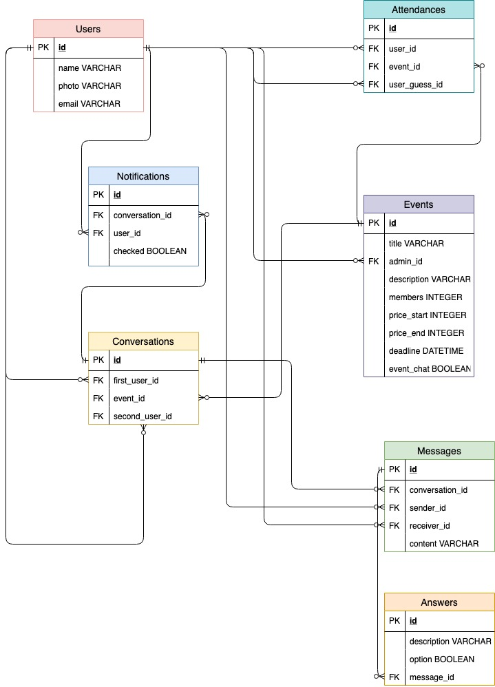

# Secret Santa

## Project description

This project is for Desafio Latam's full stack developer course and is based on the western tradition called **Secret Santa**.

## Web app access

To access this web app with heroku, click [here.](https://super-secretsanta.herokuapp.com/) Or you can install it in your computer with the next instructions.

## Installation requirements

To load this project after downloading it, you will need Ruby 2.6.0, Rails 5.2.2 and run these commands in the terminal:
- `bundle install`
- `rails db:migrate`
- `rails s`

Then enter in your preferred browser (I use Google Chrome) and enter to localhost:3000

## Client needs

"I am looking to create an app to generate my 'Secret Santa' game with the rest of my friends, I need an app that lets you create a user with name and email, and then the option to create an event appears.
Within this event you can specify the number of friends who will participate, the price of the gift and once the event is created, provide unique links to deliver to each friend for them to create an account.
The game administrator can not see the friends that correspond to each one, but can write announcements for the rest about the organization of the event (date and location where it will occur.
Secret santas can send messages to their rightful friend to give clues as to who they are or ask what the other would like."

## User stories

- As a guest, I can create a new user by entering name, email and password  to access the page later with a unique id.
  ##### Acceptance Criteria:
  + Implement Devise
  + Create model in Devise
  + Add name & photo to User

- As a guest, I can register as a new user with my Facebook account instead of registering manually.

- As an user, I can create an event indicating the number of people participating, price range of the gift, description of the event and deadline, after that I must be redirected to the event page.
  ##### Acceptance Criteria:
  + As an user, I can access to the event making page by pressing the button 'Create Event'.
  + Create model Event.
  + Add name, price range, content, deadline & members to Event.

- As owner of the event, I must be able to see on the page of the event, a unique shareable link to send to my friends and for them to be able to register in the app.
  ##### Acceptance Criteria:
  + Investigate how to create unique links in Rails.
  + As a guest, I must be redirected to the Sign In page to either enter with my account or register a new one.
  + Once I sign up or sign in, I must be redirected to the event page.

- As owner of the event I can see in the event page, I can see in a table, the status of all members who have been invited to the event, by having a 'Status' column that has either a 'Confirmed' or 'Pending' label.
  ##### Acceptance Criteria:
  + Create an automatic table, taking the quantity specified in the 'member' attribute of the Event model.
  + Newly created table must have admin 'Confirmed' in the Status column and the rest of the members 'Pending'.
  + Members of the event who had signed in, must have their names and photo displayed on the table.

- As owner of the event, I can press a button to distribute the Secret Santas, once all my friends had been registered in the event page.
  ##### Acceptance Criteria:
    + When all members have joined the event and their status is confirmed, enable the button to distribute the Secret Santas.
    + Do not permit that the Secret Santa of someone is themselves.
    + After the button has been pressed, all the participants will receive a notification to show them which person is assigned to them.

- As an user, I can send messages to my Secret Santa.
  ##### Messages:
    + As an user, I cannot see who I'm sending my message to, but my Secret Santa knows who I am.
    + As an user who is messaging another (who may be either a Secret Santa or his Giftee), my message can be a question to the other person with multiple options and the receiver can choose from those options.
    + As an user who is messaging another (who may be either a Secret Santa or his Giftee), I can personalize my question and the options.

- As an user, I can press a button in the main page of the event to 'Guess my Secret Santa'. If I write my answer, I can only try once and the button gets disabled.
  ##### Acceptance Criteria:
  + Once I pressed the button 'Guess my Secret Santa', make a dropdown menu appear, with every member of the event (except myself).
  + Before I send my guess, I must be warned that I wont be able to message my Secret Santa anymore.
  + Once I selected a member of the event and press another button called 'Confirm', the 'Guess my Secret Santa' button is disabled.

- As an user, if I try to guess my Secret Santa, I cannot know the answer until the date of the event passes to prevent knowing before the time of the event.
  ##### Acceptance Criteria:
  + Prevent from knowing the Secret Santa until the deadline of the event has been passed.
  + Disable chat from the user's Secret Santa one they have guessed.

- As an user, I can only enter my Secret Santa guess before the time of the event to prevent from cheating.
  ##### Acceptance Criteria:
  + If the event deadline has already been passed, disable the 'Guess my Secret Santa' button.

- As an user, after the event's deadline has passed, I will be able to see a ranking of all members, showing the ones who have guessed correctly. And show them in chronological order.
  ###### Acceptance Criteria:
  + Make an automatic ranking, showing the users who have guessed correctly.

- As administrator of the event, I will have a button in my event to 'Cancel the event' in case I won't be hosting one anymore to delete the page for everyone.
  ##### Acceptance Criteria:
  + Button 'Delete event' in the event page.
  + Once the button is pressed, delete the event for everyone.

## Trello

To access the Trello board, click [here.](https://trello.com/b/y0S0UhIl/secret-santa-proyecto-final-desafio-fullstack)

## Database diagram

